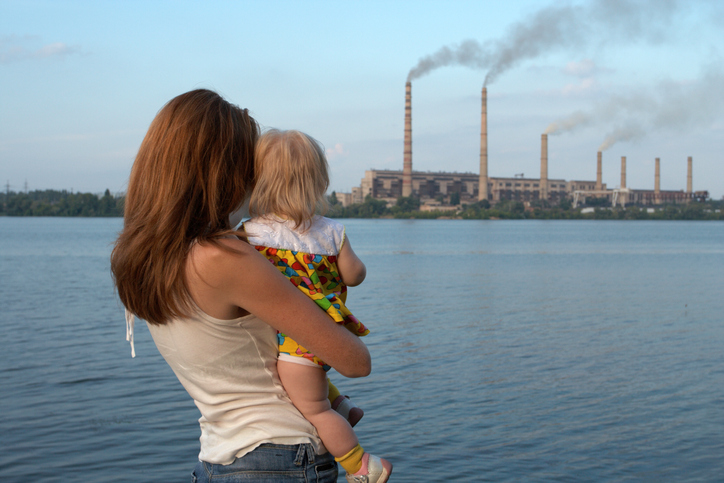

<br> 

<center>

</center>


### Project Introduction

Welcome to our website!
<br> 
For this project, we will mainly explore the correlation between birthweight of newborns and air pollution (focusing on PM2.5 concentration) with other factors like SES, racial, and gender across the New York State. 
<br> 
This project website will contain deliverables include: 

* About page
* Project Report
* Data Analysis
* R shiny APP
* Introduction video

<br/> 

### Motivation

Our motivation for this environmental health project lies in the urgent need to address the public health challenges posed by environmental factors, specifically PM2.5 air pollution, and their effects on neonatal birthweight within the diverse urban tapestry of New York State. 
Recognizing low birthweight as a critical marker of early health and future developmental trajectories, we aim to uncover the hidden dimensions of environmental health disparities.
The analysis of socioeconomic and racial factors will offer insights into the complex interplay between environment and social determinants of health, potentially guiding urban planning and healthcare resource allocation. 

<br/> 

### PM 2.5 & the hazards

<center>
Polluted air can affect human health and the environment. A key indicator of air quality is the amount of PM2.5 in the air. PM stands for particulate matter and the 2.5 refers to size.These particles are much smaller than a grain of sand or a human hair, making them small enough to be deeply inhaled into the lungs. High levels of PM2.5 can adversely affect sensitive individuals, including young children, the elderly, pregnant women, and people with allergies, heart, or lung conditions. Such individuals may experience symptoms like wheezing, coughing, chest tightness, or difficulty breathing when exposed to high PM2.5 levels.

```{r}
htmltools::tags$iframe(
  width = "70%", 
  height = "315", 
  src = "https://www.youtube.com/embed/nDCHMyNOjHM",
  frameborder = "0", 
  allowfullscreen = TRUE
)
```
</center>

<br/>

### Contributors & UNIs

* Ngan Le (nl2836) 
* Kevin Liu (kl3453)
* Zhezheng Jin (zj2358)
* Duong Nguyen (dqn2104)

